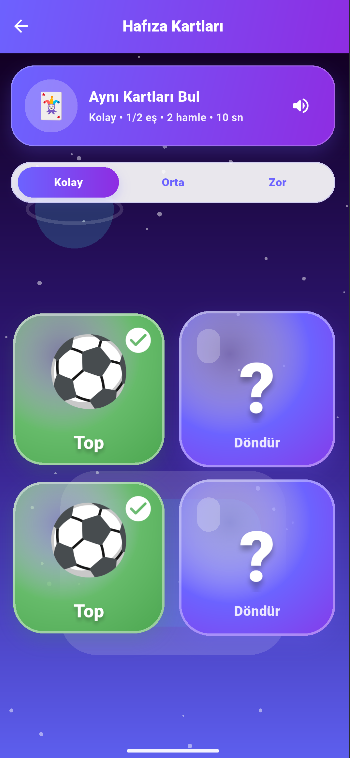
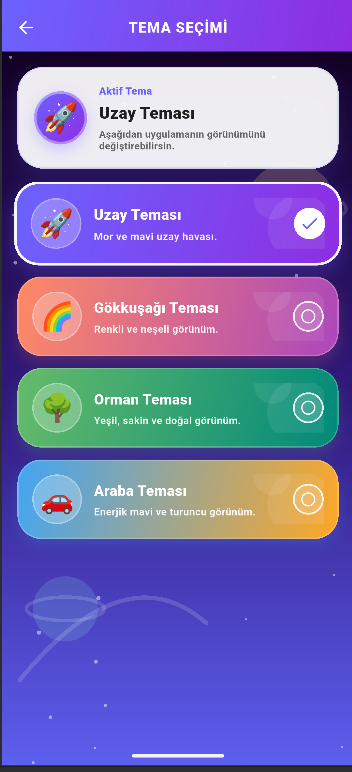
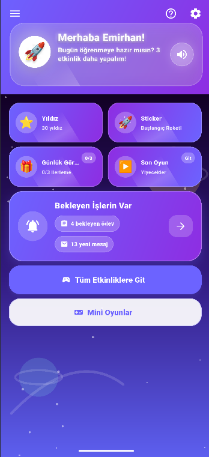
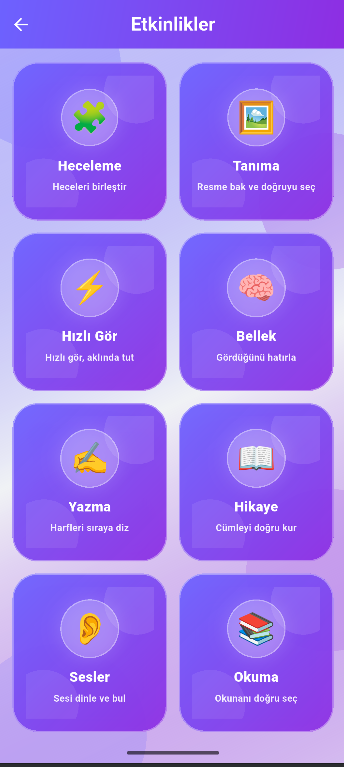

# 🚀 DİL-AS: İnteraktif Eğitim Platformu

Okuma-yazma sürecini oyunlaştıran, görsel ve işitsel hafızayı destekleyen mobil eğitim uygulaması. Öğrenciler ve çocuklar için tasarlanmış olan bu platform, interaktif etkinlikler aracılığıyla temel dil becerilerini geliştirmeyi hedefler.

## 📱 Uygulama Arayüzü

> Uygulamanın Play Store sürümünden alınan bazı ekran görüntüleri:

<table>
  <tr>
    <td></td>
    <td></td>
  </tr>
  <tr>
    <td></td>
    <td></td>
  </tr>
</table>

## 🛠️️ Teknolojiler (Tech Stack)

- **Mobil Geliştirme:** Flutter & Dart
- **Backend & Veritabanı:** Firebase (Authentication, Realtime Database)
- **Arayüz Tasarımı (UI/UX):** Figma

## ✨ Öne Çıkan Özellikler

- **Oyunlaştırılmış Öğrenme:** Etkileşimli etkinliklerle desteklenen eğitim modülleri.
- **Akıcı Animasyonlar:** Rive ve özel asset yönetimleriyle zenginleştirilmiş kullanıcı deneyimi.
- **Gelişmiş Veri Yönetimi:** Firebase üzerinden anlık veri senkronizasyonu ve kullanıcı doğrulama.
- **Güvenli Mimari:** Projedeki API anahtarları, imza dosyaları ve hassas Firebase yapılandırmaları (.gitignore ile) gizlenerek güvenli bir mimari oluşturulmuştur.

## ⚖️ Lisans ve Kullanım Hakları

*Copyright (c) 2026 Emirhan. Tüm Hakları Saklıdır (All Rights Reserved).*

Bu projenin kaynak kodları, mimarisi ve varlıkları (assets) **yalnızca portföy incelemesi amacıyla** herkese açık (public) olarak paylaşılmıştır. Projenin izinsiz kopyalanması, klonlanması, kısmen veya tamamen değiştirilerek başka projelerde kullanılması ve ticari amaçlarla yayınlanması kesinlikle yasaktır.
